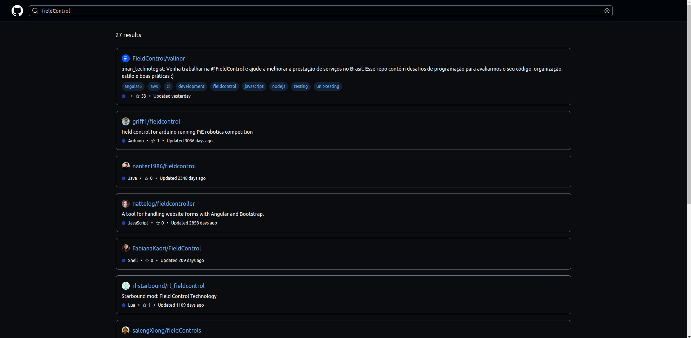
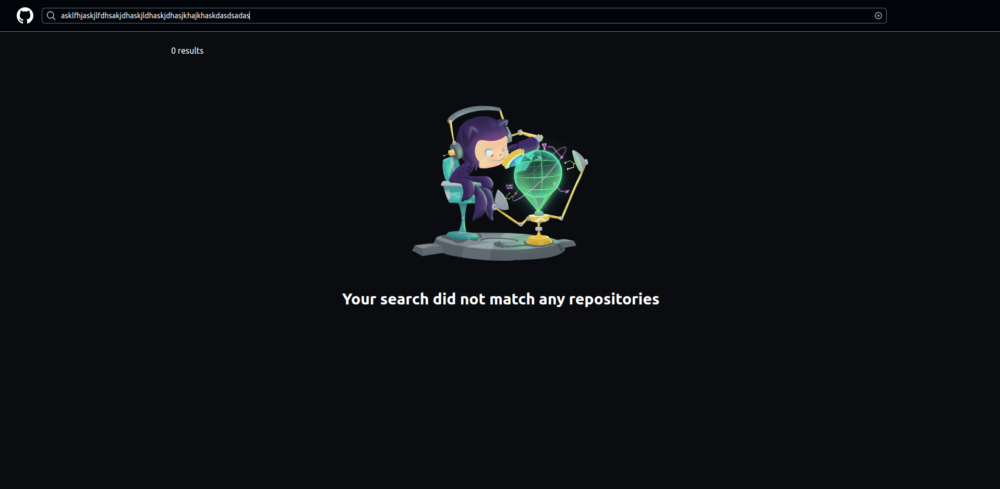
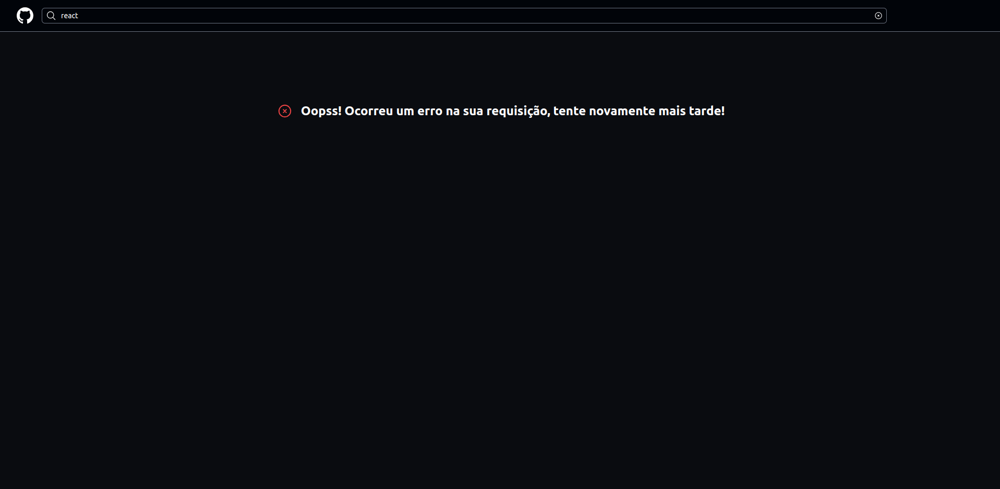

# Field Control Github Teste

Projeto de teste de código utilizando Angular + Tailwind consumindo a API do github para buscar repositórios

## Como rodar o projeto

  ```
   $ git clone https://github.com/zkauansantos/githubfinder.git

   $ cd githubfinder

   $ yarn install ou npm install

   $ ng serve

  ```
  e pronto já poderá ver rodando localmente em sua máquina em http:localhost:4200 

## Rodando testes unitários

```
  $ ng test
```

## Layout 

### Home

[]()

### Results

[]()

### Empty

[]()
### Error

[]()
